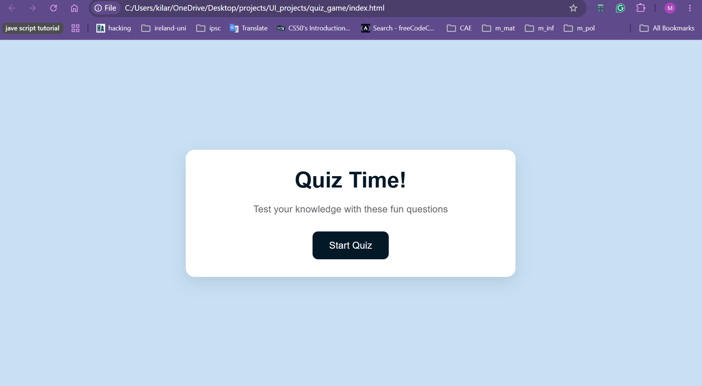
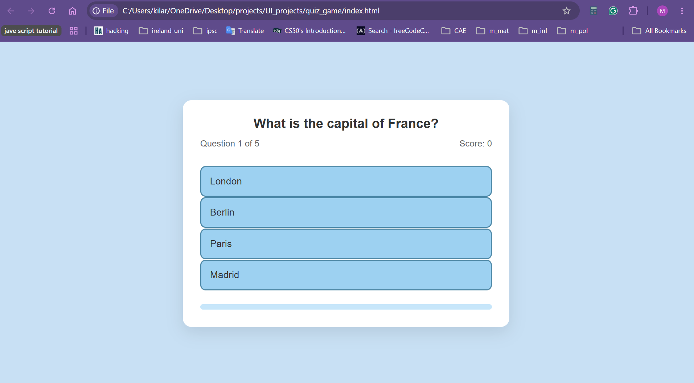
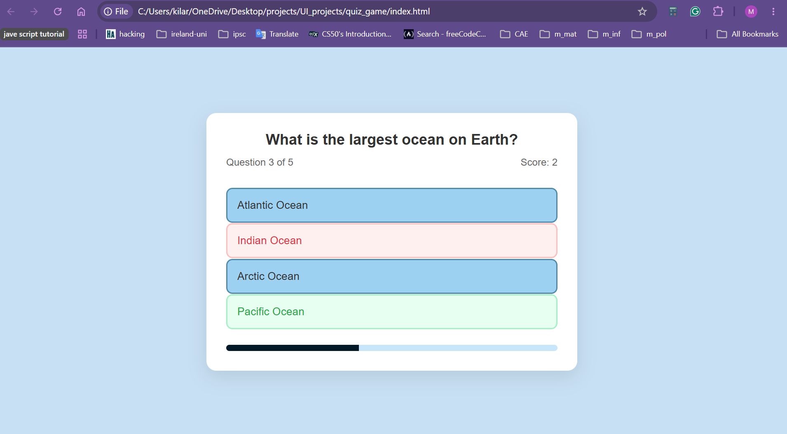

# quiz-game

A quiz application built exclusively with modern Web APIs and CSS state modifiers. The system dynamically renders programmatic question arrays, locks inputs to prevent transaction abuse, and updates interactive timeline bars to visually represent progress indicators.

---

## Interactive Gameplay & View States

The application functions as a lightweight Single Page Application (SPA) utilizing explicit view wrapper states toggled dynamically via class list modifications (`.screen.active`).

### 1. Welcome & Landing Portal
Upon application load, the state machine serves a clean, accessible landing screen that primes the user lifecycle before generating the active questions dataset.



### 2. Real-Time Option Validation
Once initialized, the engine cycles dynamically through question nodes. Selecting an option triggers an instant visual audit: correct choices light up in standard emerald success vectors, and the system freezes the controls to prevent multiple submissions.



### 3. Defensive Error Indicators
If a user selects an incorrect option, the validation logic highlights their chosen target in a clear crimson error scheme while simultaneously revealing the correct answer element to optimize user learning retention.



---

## Key Architectural Capabilities

### ⚙️ 1. Declarative View State Machine
Rather than forcing destructive page routing sequences, the application mounts three modular containers simultaneously in the document layout (`#start-screen`, `#quiz-screen`, `#result-screen`):
* **State Interchanges:** Handled seamlessly by executing `.classList.add("active")` or `.classList.remove("active")` vectors.
* **Layout Decoupling:** Styles are bound to standard hidden properties (`display: none`), with active classes dynamically expanding components into display view loops (`display: block`).

### 2. Dynamic Input Locking & Double-Submit Protection
To protect data arrays and eliminate scoring anomalies, the scoring engine locks interactive controls once a user clicks an option:
* **The Intercept Guard:** Employs a state flag (`answersDisabled = true`) to intercept input events immediately upon an active selection.
* **Visual Validation Matrix:** Iterates through options using array builders (`Array.from()`), applying color-coded classes (`.correct` or `.incorrect`) to provide immediate validation feedback while stripping click access.

### 3. Real-Time Proportional Timeline (Progress Bar)
Features an automated tracking engine designed to keep users engaged across long testing flows:
* Dynamic arithmetic algorithms continuously map the structural state ratio: `(currentQuestionIndex / quizQuestions.length) * 100`.
* The calculated percentage maps explicitly onto a CSS width transform parameter using an accelerated transition animation matrix (`transition: width 0.3s ease`).

---

## Technical Highlights

* **Pure Separation of Concerns:** Core question metrics are cleanly isolated inside modular JSON array objects containing text descriptors, answer sub-arrays, and Boolean correct flags.
* **Asynchronous Thread Control:** Employs precise callback timing wrappers (`setTimeout()`) to delay scene transitions by exactly 1000ms, providing users with feedback before moving to the next question.
* **Polymorphic Scoring Output:** Computes contextual string messages ("Perfect!", "Great job!", etc.) on the final card layout based on raw accuracy percentages.

---

## Quick Execution

Run this lightweight frontend package on your system without installing build servers or package runtimes:

1. Clone the project files locally:
   ```bash
   git clone [https://github.com/YOUR_USERNAME/vanilla-js-quiz-game.git](https://github.com/YOUR_USERNAME/vanilla-js-quiz-game.git)
